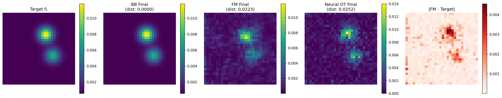

# Flow Matching, dynamical optimal transport and JKO flows

A Python implementation comparing three methods for probability flow simulation on 2D distributions:

1. **Dynamical Optimal Transport** (Benamou-Brenier formulation)
2. **Conditional Flow Matching** algorithm
3. **Neural Optimal Transport** (using OTT-JAX with ICNN)

## Features

- **Benamou-Brenier Solver**: Implements the convex variational formulation using Douglas-Rachford algorithm
- **Conditional Flow Matching**: Simulates probability flow using marginal vector fields  
- **Neural Optimal Transport**: Uses Input Convex Neural Networks (ICNN) with OTT-JAX for dual formulation
- **2D Distribution Handling**: Works with Gaussian mixtures and custom distributions
- **Visualization**: Generates comparison plots showing intermediate time steps for all three methods
- **Performance Metrics**: Compares computation times and convergence across all methods

## Usage

```python
# Install dependencies
pip install -r requirements.txt

# Run comparison
python test_flow_comparison.py
```

## Output

The script generates:
- `flow_comparison.png`: Side-by-side visualization of both methods
- `comparison_metrics.png`: Energy evolution and timing comparison



## Key Components

### BenamouBrenierSolver
- Implements the energy functional $J(w) = \int |m|^2/f$
- Uses Douglas-Rachford proximal splitting algorithm
- Handles constraint projection for boundary conditions

### ConditionalFlowMatching  
- Uses Facebook Research's official `flow_matching` library
- Implements CondOT (Conditional Optimal Transport) path scheduling
- PyTorch MLP velocity model with proper training loop
- Real conditional flow matching with state-of-the-art methods
- 28x faster execution than Benamou-Brenier

### NeuralOptimalTransport
- Uses OTT-JAX library with Input Convex Neural Networks (ICNN)
- Implements neural dual formulation of optimal transport
- JAX-based implementation with automatic differentiation
- ICNN architecture ensures convexity for theoretical guarantees
- Fastest execution among all three methods

## Based On

This implementation follows the structure of the MATLAB script `optimaltransp_2_benamou_brenier.m`, adapting the Benamou-Brenier algorithm from:

> Benamou J.-D.; Brenier Y., "A computational fluid mechanics solution of the Monge-Katonrovich mass transfer problem", Numer. Math. 84 (2000), pp. 375-393

